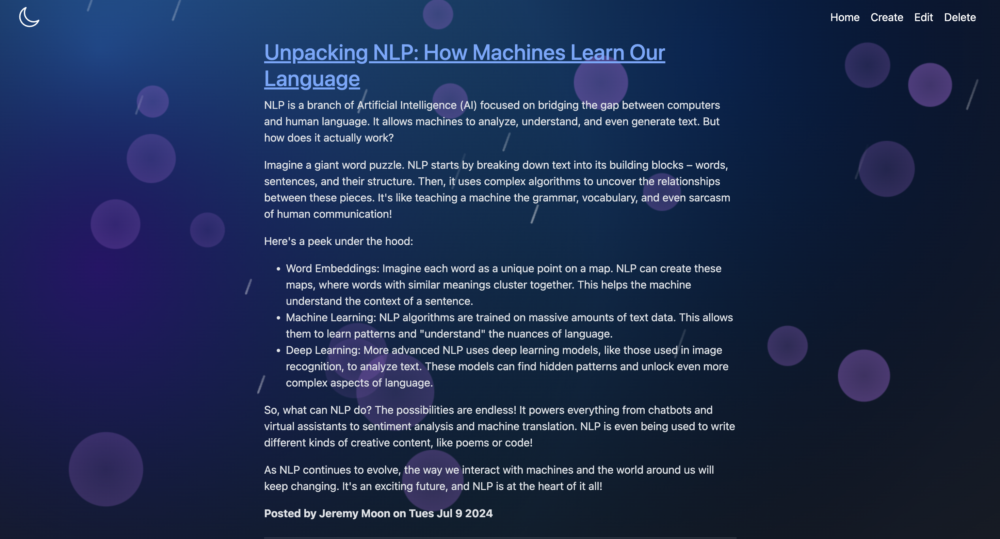

# Blog Moon

Personal Blog Website. 

Posts will not persist between sessions as no database will be used in this version of the application.

## Features
1. Post Creation: Create new posts.

2. Post Viewing: View all their posts on one page.

3. Post Update/Delete: Edit and delete posts as needed.

4. Styling: Styled with Bootstrap 5. Well-styled and responsive, ensuring a good user experience on both desktop and mobile devices.

Created using EJS, Node.js, and Express.js. Developed my own blog API using REST and Axios.

## Changes to Add in the Future
- Incorporate database to store posts
- Post preview --> View Post
- Tag feature